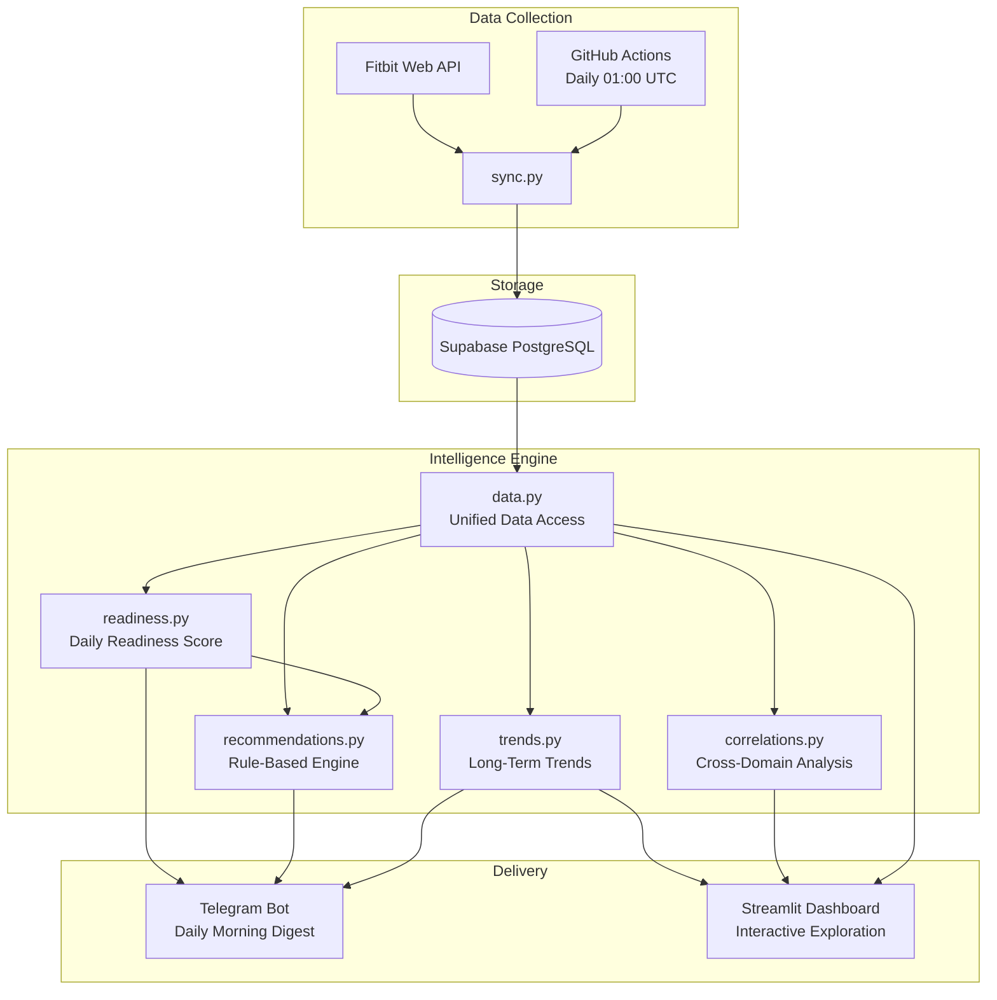
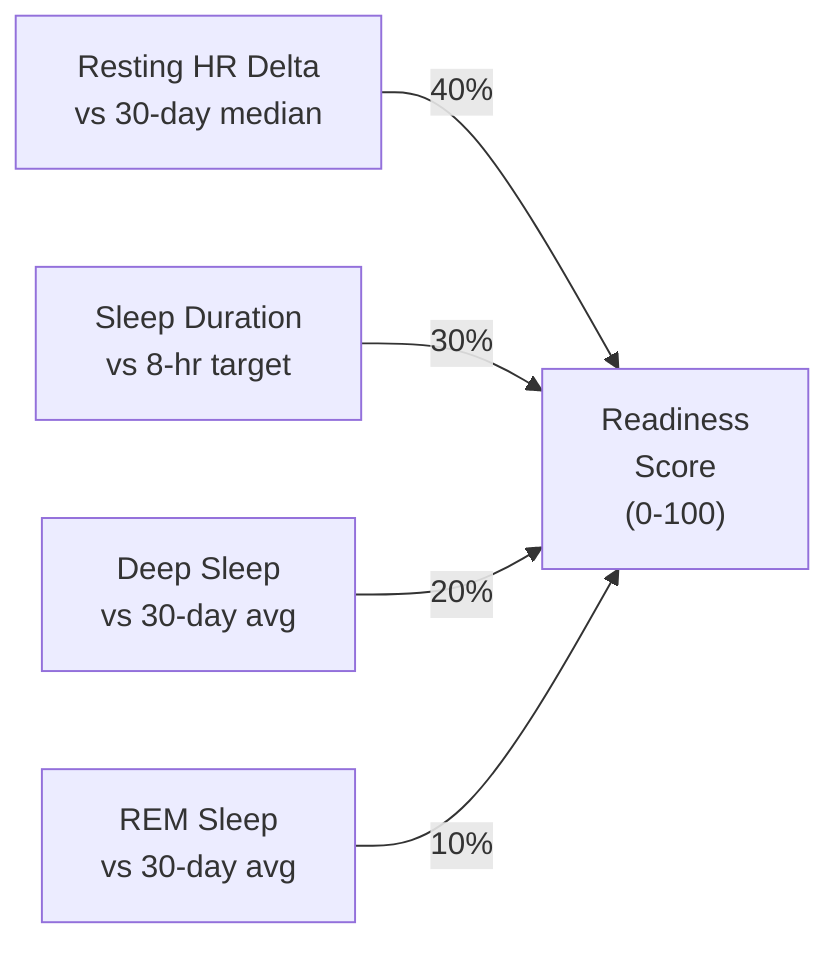
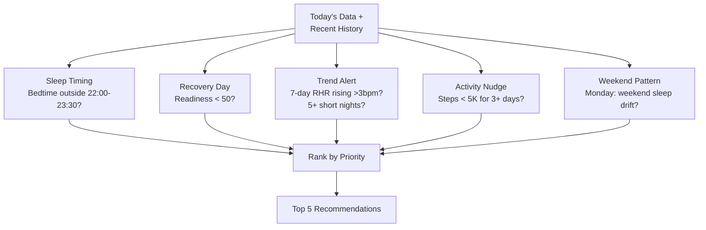
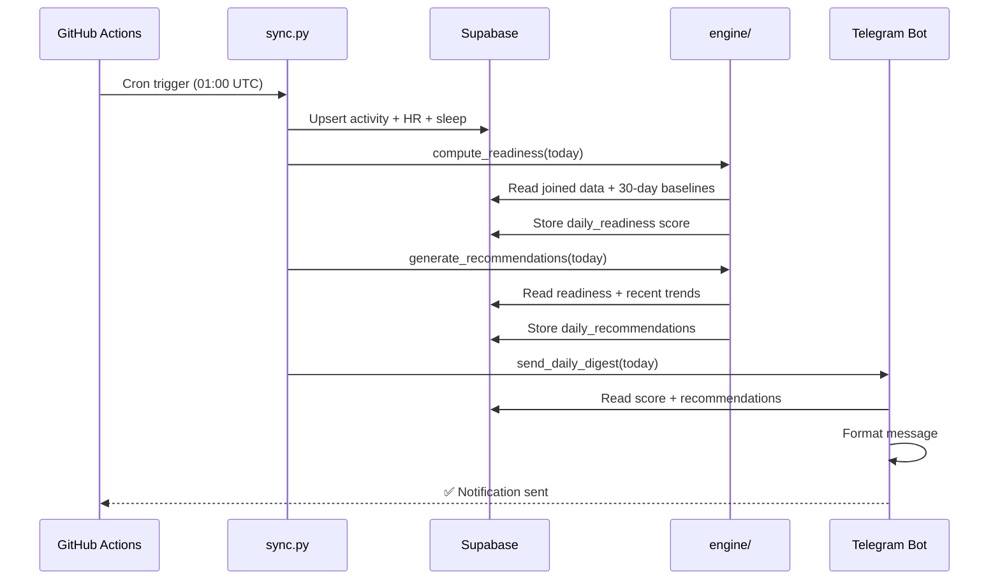
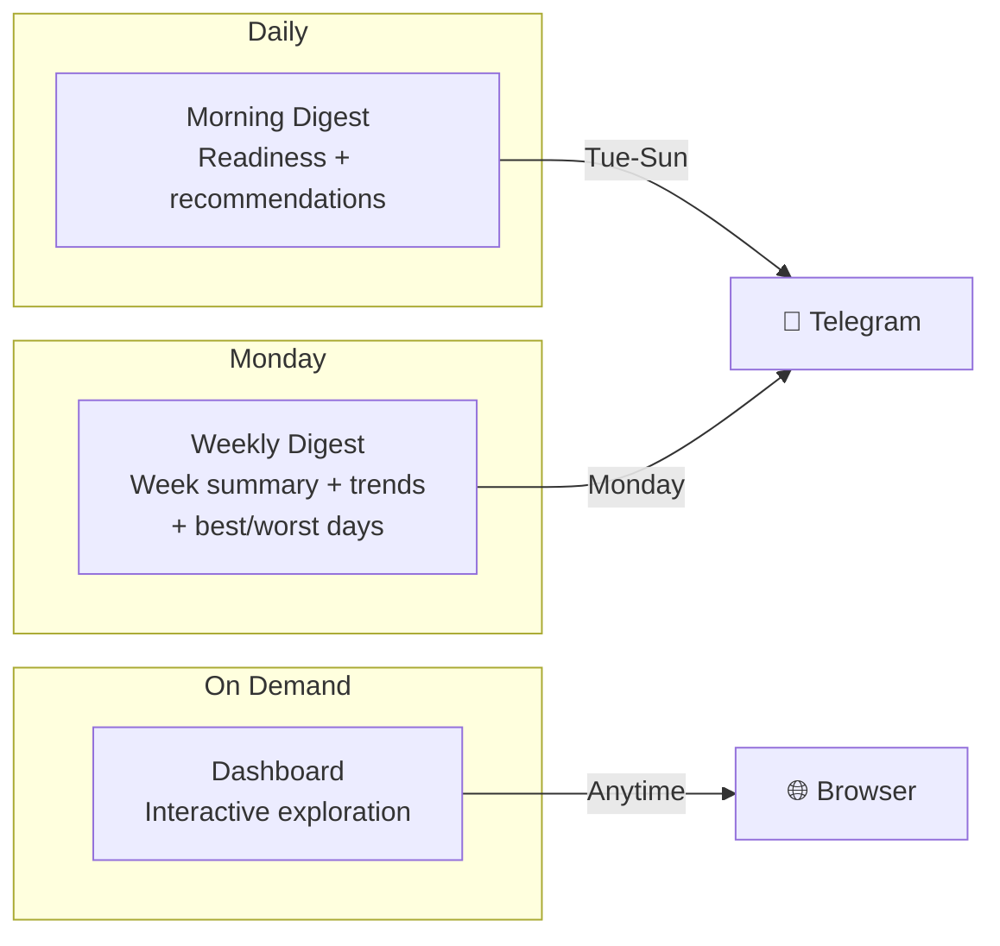
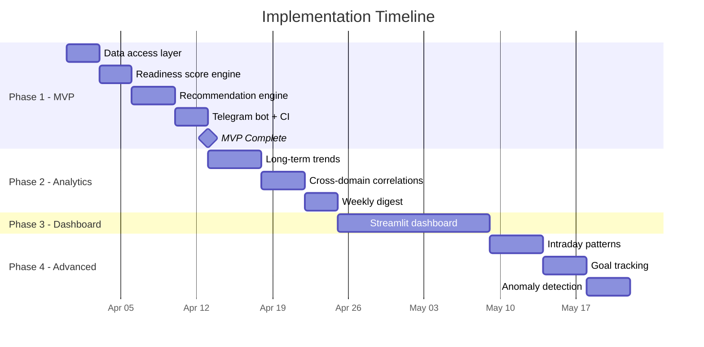

# Fitbit Personal Health Companion — Product Roadmap

## Context
The current project is a solid data pipeline (Fitbit API → Supabase) with some local sleep analysis scripts. But it's passive — you have to run scripts manually to get any value. The goal is to turn this into an **active daily health companion** that sends personalized insights to your phone every morning, like a personal Whoop/Oura but powered by 3 years of YOUR data.

**User decisions:**
- Delivery: Telegram Bot (daily push notifications)
- Goal: Personal health companion (daily actionable value)
- Scope: Lean MVP first (1-2 weeks), then iterate
- Tech: Open to any packages needed

---

## Architecture Vision



---

## Phase 1: Daily Intelligence MVP (Weeks 1-2)

### 1.1 Unified Data Access Layer
**New file:** `fitbit/data.py`

- Single module with functions that query Supabase and return joined cross-domain data
- `get_daily_snapshot(date)` → dict with activity + HR + sleep for one day
- `get_range(start, end)` → pandas DataFrame joining all 3 tables
- `get_rolling_baselines(date, window=30)` → dict of personal baselines (median RHR, avg deep/REM/sleep duration)
- Migrate analysis scripts off local SQLite to use this module
- **Add `pandas` to requirements.txt**

**Why first:** Everything downstream depends on clean, joined data access from Supabase.

**Files to modify:**
- New: `fitbit/data.py`
- Modify: `requirements.txt` (add pandas)
- Modify: `analysis/sleep_analysis.py` (swap SQLite for data.py)
- Modify: `analysis/sleep_window_analysis.py` (swap SQLite for data.py)

---

### 1.2 Readiness Score — Computed & Stored Daily
**New table:** `daily_readiness`

```sql
CREATE TABLE daily_readiness (
    date              DATE PRIMARY KEY,
    readiness_score   NUMERIC(5,1),
    rhr_component     NUMERIC(5,1),
    sleep_component   NUMERIC(5,1),
    deep_component    NUMERIC(5,1),
    rem_component     NUMERIC(5,1),
    rhr_baseline      NUMERIC(5,1),
    deep_baseline     NUMERIC(5,1),
    rem_baseline      NUMERIC(5,1),
    computed_at       TIMESTAMPTZ DEFAULT NOW()
);
```

**Readiness Score Formula (0-100):**



- Move readiness formula from `sleep_window_analysis.py` into `engine/readiness.py`
- **Make baselines dynamic:** rolling 30-day median RHR, rolling 30-day avg deep/REM (replace hardcoded 96/82)
- Compute after each sync run; backfill all historical dates on first run
- Store component scores for debugging ("why is my readiness low today?")

**Files to modify:**
- New: `engine/__init__.py`, `engine/readiness.py`
- Modify: `fitbit/supabase_db.py` (add table creation + upsert for daily_readiness)
- Modify: `sync.py` (call readiness computation after data sync)

---

### 1.3 Recommendation Engine v1 (Rule-Based)
**New file:** `engine/recommendations.py`

5 rule categories, each a function returning `Optional[Recommendation]`:



| Rule | Trigger | Example Output |
|------|---------|----------------|
| **Sleep timing** | Bedtime outside 22:00-23:30 window | "You went to bed at 01:15. On late nights, your deep sleep averages 62 min vs 95 min on optimal nights." |
| **Recovery day** | Readiness < 50 | "Readiness 42 today (RHR 85 vs your 79 baseline). On similar days you average 4,200 steps. Consider a rest day." |
| **Trend alert** | 7-day rolling RHR rising >3bpm OR 5+ consecutive nights <6hrs | "Your resting HR has risen 4 bpm this week (79→83). Watch for overtraining or illness." |
| **Activity nudge** | Steps < 5,000 for 3+ days | "You've averaged 3,800 steps the last 3 days. In your data, inactive stretches correlate with 8% worse sleep efficiency." |
| **Weekend pattern** | Monday morning, weekend sleep was very different from weekday | "Weekend sleep averaged 8.5 hrs vs 5.8 hrs on weekdays. This 2.7hr swing ('social jet lag') may affect your Monday." |

**Implementation:**
- Each rule: function that takes today's data + recent history → `Optional[Recommendation]`
- `Recommendation` dataclass: `priority` (1-5), `category`, `message`, `supporting_data`
- `generate_daily_recommendations(date)` → runs all rules, returns top 5 by priority
- Store in `daily_recommendations` table for history

**Files to modify:**
- New: `engine/recommendations.py`
- Modify: `fitbit/supabase_db.py` (add daily_recommendations table)

---

### 1.4 Telegram Bot — Daily Morning Digest
**New file:** `notifications/__init__.py`, `notifications/telegram.py`

**Setup:**
1. Create bot via @BotFather on Telegram → get bot token
2. Get your chat ID (send /start to bot, query getUpdates API)
3. Add `TELEGRAM_BOT_TOKEN` and `TELEGRAM_CHAT_ID` to GitHub Actions secrets

**Message format:**
```
🟢 Morning Readiness — Mar 28

Score: 72/100 (Good)
━━━━━━━━━━━━━━━━━━━━
🫀 RHR: 77 bpm (−2 from baseline)
😴 Sleep: 7.2 hrs | Efficiency: 91%
🧠 Deep: 88 min | REM: 75 min

📋 Today's Recommendations:
1. Bedtime was 22:45 — right in the sweet spot ✓
2. REM was 8% below average — limit screens before bed
3. Averaging 5,100 steps this week — push for 7,000+ today

📈 7-Day Trend: Readiness ↑3 pts | RHR stable | Sleep +18 min
```

**End-to-end flow:**



**Files to modify:**
- New: `notifications/__init__.py`, `notifications/telegram.py`
- Modify: `requirements.txt` (add `python-telegram-bot`)
- Modify: `.github/workflows/daily_sync.yml` (add notification step + secrets)
- Modify: `.env.example` (add TELEGRAM_BOT_TOKEN, TELEGRAM_CHAT_ID)

---

### Phase 1 Milestone
> Every morning, you receive a Telegram message with your readiness score and 3-5 personalized recommendations based on your 3-year data history.

---

## Phase 2: Deep Analytics (Weeks 3-5)

### 2.1 Long-Term Trend Engine
**New file:** `engine/trends.py`

- Monthly aggregations: avg steps, avg RHR, avg sleep duration, avg readiness
- Quarterly comparison: "Q1 2026 vs Q4 2025"
- Resting HR trajectory: monthly averages over 3 years (this IS your cardio fitness score — a drop from 82→75 over a year is a meaningful health improvement, invisible in a 30-day view)
- Seasonal patterns: does sleep quality vary by month? (with 3 years you can answer this)
- Activity consistency score: std deviation of daily steps (consistent vs. spiky)
- New table: `monthly_summaries` (cached aggregations)

### 2.2 Cross-Domain Correlations
**New file:** `engine/correlations.py`

- Steps day N vs sleep quality night N (does more activity = better sleep FOR YOU?)
- Cardio+peak zone minutes vs next-night deep sleep
- Sleep debt accumulation: consecutive short nights vs readiness decline curve
- Natural language findings: "Days with 8,000+ steps → 14% more deep sleep (r=0.31)"
- Add `scipy` to requirements for statistical tests

### 2.3 Weekly Digest (Telegram)
- Monday morning message with week summary
- Trend direction (improving/declining/stable) for each metric
- Best/worst day of the week and why
- "This week vs last week" comparison



---

## Phase 3: Web Dashboard (Weeks 6-8)

### 3.1 Streamlit Dashboard
**New file:** `dashboard/app.py`

| Section | Content |
|---------|---------|
| **Today** | Readiness gauge, sleep summary, today's recommendations |
| **Trends** | Interactive Plotly charts with date range selector (7d / 30d / 90d / 1y / all) |
| **Sleep** | Migrate existing 7 chart types to interactive versions |
| **Correlations** | Scatter plots from Phase 2 |
| **Calendar** | Heatmap of readiness scores color-coded by day |

- Deploy free on Streamlit Community Cloud (connects to GitHub repo)
- Add `streamlit`, `plotly` to requirements

---

## Phase 4: Advanced Features (Weeks 9+)

### 4.1 Intraday Activity Patterns
- Activate the unused `get_intraday()` method in `client.py` (already implemented, never called)
- New table: `intraday_activity` (date, time, steps, calories)
- Auto-detect workout sessions (consecutive high-activity windows)
- Surface in daily digest: "45-min walk at 18:15 (4,200 steps)"

### 4.2 Goal Tracking
- New table: `goals` (metric, target, period)
- Progress tracking integrated into Telegram: "Weekly goal: 50K steps — at 32K (64%) with 3 days left"
- Goal suggestions based on personal data patterns

### 4.3 Anomaly Detection
- Rolling z-scores: flag values >2σ from 30-day rolling mean
- High-priority alerts: "RHR 88 bpm today — 9 above your baseline. Possible illness onset."
- Feed anomalies into recommendation engine as top-priority items

### 4.4 ML-Based Insights (Stretch)
- Predict tonight's sleep quality from today's activity/HR patterns
- Classify "good readiness days" vs "bad" and surface differentiating factors
- Personalized optimal step target (not generic 10K — YOUR optimal number based on sleep correlation)

---

## Implementation Order (Critical Path)



---

## New Project Structure (After Phase 1)

```
fitbit_api_recommendation/
├── fitbit/                      # Core library package
│   ├── __init__.py
│   ├── auth.py                  # OAuth 2.0 flow
│   ├── client.py                # Fitbit API client
│   ├── data.py                  # NEW — Unified data access layer
│   ├── database.py              # SQLite layer (legacy)
│   └── supabase_db.py           # Supabase layer (primary)
├── engine/                      # NEW — Intelligence layer
│   ├── __init__.py
│   ├── readiness.py             # Readiness score computation
│   ├── recommendations.py       # Rule-based recommendation engine
│   ├── trends.py                # (Phase 2) Long-term trends
│   └── correlations.py          # (Phase 2) Cross-domain analysis
├── notifications/               # NEW — Delivery layer
│   ├── __init__.py
│   └── telegram.py              # Telegram bot for daily digest
├── analysis/                    # Existing analysis scripts (migrated to Supabase)
│   ├── sleep_analysis.py
│   └── sleep_window_analysis.py
├── dashboard/                   # (Phase 3) Web UI
│   └── app.py
├── docs/                        # Documentation
│   └── PRODUCT_ROADMAP.md
├── .github/workflows/
│   └── daily_sync.yml           # Extended: sync + readiness + recommendations + notify
├── sync.py                      # Extended: triggers engine after sync
├── scheduler.py
├── .env.example
└── requirements.txt             # Extended: + pandas, python-telegram-bot
```

---

## New Dependencies

| Phase | Package | Purpose |
|-------|---------|---------|
| 1 | `pandas>=2.2` | Data manipulation and joins |
| 1 | `python-telegram-bot>=21.0` | Telegram notifications |
| 2 | `scipy>=1.14` | Statistical correlations |
| 3 | `streamlit>=1.40` | Web dashboard |
| 3 | `plotly>=6.0` | Interactive charts |

---

## Verification Checklist (Phase 1)

- [ ] `python sync.py` syncs data AND computes/stores readiness score
- [ ] `SELECT * FROM daily_readiness ORDER BY date DESC LIMIT 5` shows scores in Supabase
- [ ] `python -m engine.recommendations` prints today's recommendations
- [ ] `python -m notifications.telegram` sends test message to Telegram
- [ ] GitHub Actions workflow: sync → compute → notify end-to-end
