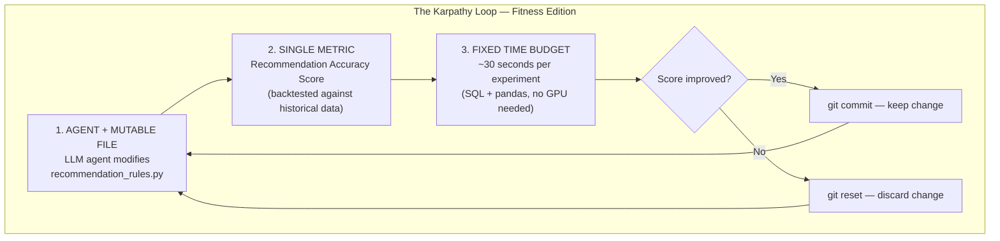
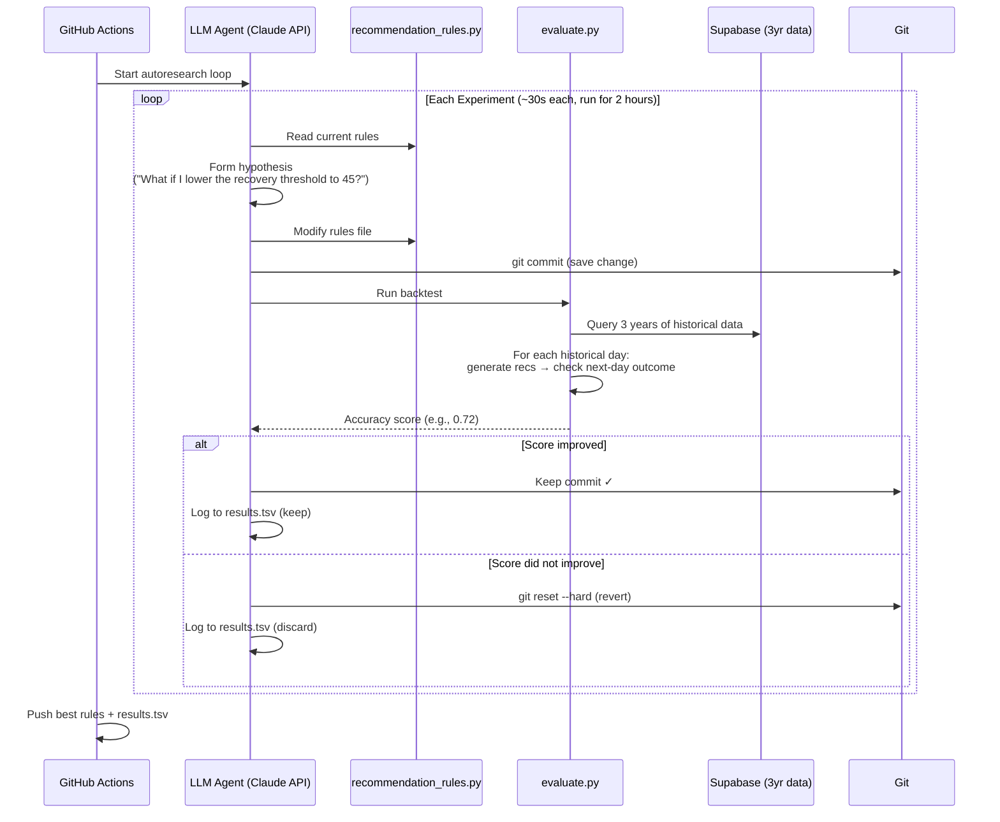

# Fitbit Personal Health Companion — Product Roadmap

## Context
The current project is a solid data pipeline (Fitbit API → Supabase) with some local sleep analysis scripts. But it's passive — you have to run scripts manually to get any value. The goal is to turn this into an **active daily health companion** that sends personalized insights to your phone every morning, like a personal Whoop/Oura but powered by 3 years of YOUR data.

## AutoResearch Integration (Karpathy Loop for Fitness)

### What is AutoResearch?
[Karpathy's autoresearch](https://github.com/karpathy/autoresearch) is a 630-line autonomous experiment loop. The core pattern (the "Karpathy Loop") has 3 components:
1. **An agent with one file it can modify** (the experiment code)
2. **A single, objectively testable metric** to optimize
3. **A fixed time limit per experiment**

The agent runs continuously: hypothesize → modify code → run → measure → keep or discard → repeat. It ran 700 experiments in 2 days and found 20 genuine improvements to LLM training.

### Adapting the Karpathy Loop for Fitness Recommendations

**Goal:** Autonomously optimize the recommendation engine's rules, thresholds, and correlations by running hundreds of experiments against 3 years of historical Fitbit data overnight via GitHub Actions.

#### The Three Components (Fitness Edition)



#### How It Works — Detailed

**The Metric: Recommendation Accuracy Score**

The agent optimizes one number: "How often do the recommendations correctly predict/correlate with the next day's outcome?"

Scoring method (backtested on historical data):
- For each historical day, the engine generates recommendations using only data available up to that day
- Each recommendation is scored against what actually happened next:
  - "Recovery day" recommendation + actual low steps next day → +1 (correct)
  - "Push harder" recommendation + actual high activity next day → +1 (correct)
  - "Sleep timing" warning + actually worse deep sleep that night → +1 (correct)
  - Incorrect prediction → 0
- **Metric = correct predictions / total predictions across all historical days**

This is analogous to Karpathy's `val_bpb` — a single number the agent tries to maximize.

**The Mutable File: `recommendation_rules.py`**

The agent can modify:
- Rule thresholds (e.g., "readiness < 50" → try "readiness < 45" or "readiness < 55")
- Correlation lookback windows (7-day rolling → try 5-day or 14-day)
- Which data features each rule uses
- Rule priority weights
- Add entirely new rules it discovers from the data
- Remove rules that don't improve the score

**The Fixed Files (agent CANNOT modify):**
- `fitbit/data.py` — data access layer (like Karpathy's `prepare.py`)
- `autoresearch/evaluate.py` — backtesting harness that computes the accuracy score (like Karpathy's evaluation in `prepare.py`)
- `autoresearch/program.md` — instructions for the agent

#### File Structure

```
autoresearch/
├── program.md                    # Agent instructions (human-edited)
├── evaluate.py                   # Backtesting harness (FIXED, not modifiable)
├── recommendation_rules.py       # THE MUTABLE FILE — agent modifies this
├── results.tsv                   # Experiment log (commit, score, status, description)
└── run.py                        # Orchestrator: calls LLM API, runs loop
```

#### The Experiment Loop (GitHub Actions)



#### program.md (Agent Instructions)

The agent receives instructions similar to Karpathy's `program.md`:

```markdown
# Fitness Recommendation AutoResearch

You are an autonomous research agent optimizing fitness recommendations.

## Your task
Modify `recommendation_rules.py` to maximize the recommendation accuracy
score computed by `evaluate.py`. You CANNOT modify `evaluate.py` or any
file in `fitbit/`.

## Workflow per experiment
1. Read `recommendation_rules.py` and `results.tsv`
2. Form a hypothesis (what change might improve the score?)
3. Edit `recommendation_rules.py`
4. Run: `python autoresearch/evaluate.py`
5. Read the score from stdout
6. If improved → keep. If not → revert.
7. Log result to `results.tsv`
8. Repeat. Do NOT ask "should I keep going?" — run continuously.

## What you can change
- Rule thresholds and conditions
- Feature combinations used in rules
- Lookback windows for rolling computations
- Rule priority weights
- Add new rules based on patterns you discover
- Remove rules that consistently score poorly

## What you CANNOT change
- evaluate.py (the scoring harness)
- Any file in fitbit/ (the data layer)
- The metric definition

## Guidelines
- Make one focused change per experiment
- Keep changes small and testable
- Read results.tsv to learn from past experiments
- If stuck, try a completely different approach rather than small variations
```

#### evaluate.py (Backtesting Harness)

The evaluation script:
1. Loads all historical data from Supabase (activity + HR + sleep, joined)
2. Splits into train (first 80%) and test (last 20%) periods
3. For each day in the test period:
   - Calls `generate_recommendations(date)` from `recommendation_rules.py` using only data up to that date
   - Checks each recommendation against what actually happened next
   - Scores: correct/incorrect
4. Outputs single metric: `accuracy = correct / total`

#### What the Agent Discovers (Expected Findings)

Based on the 3 years of data patterns, the agent would likely discover and optimize:
- The exact readiness threshold for "recovery day" recommendations (is it 45? 50? 55?)
- Whether 7-day or 14-day rolling averages better predict next-day outcomes
- Which sleep metric matters most for next-day predictions (deep sleep? efficiency? total duration?)
- Whether bedtime or wake time is more predictive of sleep quality
- Optimal step targets personalized to YOUR data (not a generic 10K)
- Day-of-week-specific thresholds (Monday rules differ from Friday rules)
- Whether HR zone minutes or resting HR is more actionable

#### Integration with Phase 1

The autoresearch loop is an **enhancement** to Phase 1, not a replacement:

1. **Phase 1 (Weeks 1-2):** Build the recommendation engine with hand-tuned rules (the MVP)
2. **AutoResearch (Week 3):** Point the Karpathy Loop at the recommendation engine and let it optimize overnight
3. **Ongoing:** Run autoresearch weekly (Sunday night GitHub Actions cron) to continuously improve recommendations as new data accumulates

#### GitHub Actions Workflow

```yaml
name: AutoResearch — Optimize Recommendations
on:
  schedule:
    - cron: '0 22 * * 0'  # Every Sunday at 22:00 UTC
  workflow_dispatch:       # Manual trigger

jobs:
  autoresearch:
    runs-on: ubuntu-latest
    timeout-minutes: 120   # 2-hour experiment budget

    steps:
      - uses: actions/checkout@v4
      - uses: actions/setup-python@v5
        with:
          python-version: '3.12'
      - run: pip install -r requirements.txt

      - name: Run autoresearch loop
        env:
          SUPABASE_DB_URL: ${{ secrets.SUPABASE_DB_URL }}
          ANTHROPIC_API_KEY: ${{ secrets.ANTHROPIC_API_KEY }}
        run: python autoresearch/run.py --budget 7200  # 2 hours

      - name: Push optimized rules
        run: |
          git config user.name "autoresearch-bot"
          git config user.email "autoresearch@noreply"
          git add autoresearch/recommendation_rules.py autoresearch/results.tsv
          git commit -m "autoresearch: accuracy $(tail -1 autoresearch/results.tsv | cut -f2) ($(wc -l < autoresearch/results.tsv) experiments)"
          git push
```

#### Cost Estimate

- Each experiment: ~1 API call to Claude (hypothesis + code edit) ≈ $0.02-0.05
- 2-hour budget at ~30s/experiment ≈ 240 experiments
- Weekly cost: ~$5-12 in API calls
- Value: continuously improving, personalized recommendations backed by statistical evidence

---

**User decisions:**
- Delivery: Telegram Bot (daily push notifications)
- Goal: Personal health companion (daily actionable value)
- Scope: Lean MVP first (1-2 weeks), then iterate
- Tech: Open to any packages needed

---

## Phase 1: Daily Intelligence MVP (Weeks 1-2)

### 1.1 Unified Data Access Layer
**New file:** `fitbit/data.py`

- Single module with functions that query Supabase and return joined cross-domain data
- `get_daily_snapshot(date)` → dict with activity + HR + sleep for one day
- `get_range(start, end)` → pandas DataFrame joining all 3 tables
- `get_rolling_baselines(date, window=30)` → dict of personal baselines (median RHR, avg deep/REM/sleep duration)
- Migrate analysis scripts off local SQLite to use this module
- **Add `pandas` to requirements.txt**

**Why first:** Everything downstream depends on clean, joined data access from Supabase.

**Files to modify:**
- New: `fitbit/data.py`
- Modify: `requirements.txt` (add pandas)
- Modify: `analysis/sleep_analysis.py` (swap SQLite for data.py)
- Modify: `analysis/sleep_window_analysis.py` (swap SQLite for data.py)

---

### 1.2 Readiness Score — Computed & Stored Daily
**New table:** `daily_readiness`

```sql
CREATE TABLE daily_readiness (
    date              DATE PRIMARY KEY,
    readiness_score   NUMERIC(5,1),
    rhr_component     NUMERIC(5,1),
    sleep_component   NUMERIC(5,1),
    deep_component    NUMERIC(5,1),
    rem_component     NUMERIC(5,1),
    rhr_baseline      NUMERIC(5,1),
    deep_baseline     NUMERIC(5,1),
    rem_baseline      NUMERIC(5,1),
    computed_at       TIMESTAMPTZ DEFAULT NOW()
);
```

- Move readiness formula from `sleep_window_analysis.py` into `engine/readiness.py`
- **Make baselines dynamic:** rolling 30-day median RHR, rolling 30-day avg deep/REM (replace hardcoded 96/82)
- Compute after each sync run; backfill all historical dates on first run
- Store component scores for debugging ("why is my readiness low today?")

**Files to modify:**
- New: `engine/__init__.py`, `engine/readiness.py`
- Modify: `fitbit/supabase_db.py` (add table creation + upsert for daily_readiness)
- Modify: `sync.py` (call readiness computation after data sync)

---

### 1.3 Recommendation Engine v1 (Rule-Based)
**New file:** `engine/recommendations.py`

5 rule categories, each a function returning `Optional[Recommendation]`:

| Rule | Trigger | Example Output |
|------|---------|----------------|
| **Sleep timing** | Bedtime outside 22:00-23:30 window | "You went to bed at 01:15. On late nights, your deep sleep averages 62 min vs 95 min on optimal nights." |
| **Recovery day** | Readiness < 50 | "Readiness 42 today (RHR 85 vs your 79 baseline). On similar days you average 4,200 steps. Consider a rest day." |
| **Trend alert** | 7-day rolling RHR rising >3bpm OR 5+ consecutive nights <6hrs | "Your resting HR has risen 4 bpm this week (79→83). Watch for overtraining or illness." |
| **Activity nudge** | Steps < 5,000 for 3+ days | "You've averaged 3,800 steps the last 3 days. In your data, inactive stretches correlate with 8% worse sleep efficiency." |
| **Weekend pattern** | Monday morning, weekend sleep was very different from weekday | "Weekend sleep averaged 8.5 hrs vs 5.8 hrs on weekdays. This 2.7hr swing ('social jet lag') may affect your Monday." |

**Implementation:**
- Each rule: function that takes today's data + recent history → `Optional[Recommendation]`
- `Recommendation` dataclass: `priority` (1-5), `category`, `message`, `supporting_data`
- `generate_daily_recommendations(date)` → runs all rules, returns top 5 by priority
- Store in `daily_recommendations` table for history

**Files to modify:**
- New: `engine/recommendations.py`
- Modify: `fitbit/supabase_db.py` (add daily_recommendations table)

---

### 1.4 Telegram Bot — Daily Morning Digest
**New file:** `notifications/__init__.py`, `notifications/telegram.py`

**Setup:**
1. Create bot via @BotFather on Telegram → get bot token
2. Get your chat ID (send /start to bot, query getUpdates API)
3. Add `TELEGRAM_BOT_TOKEN` and `TELEGRAM_CHAT_ID` to GitHub Actions secrets

**Message format:**
```
🟢 Morning Readiness — Mar 28

Score: 72/100 (Good)
━━━━━━━━━━━━━━━━━━━━
🫀 RHR: 77 bpm (−2 from baseline)
😴 Sleep: 7.2 hrs | Efficiency: 91%
🧠 Deep: 88 min | REM: 75 min

📋 Today's Recommendations:
1. Bedtime was 22:45 — right in the sweet spot ✓
2. REM was 8% below average — limit screens before bed
3. Averaging 5,100 steps this week — push for 7,000+ today

📈 7-Day Trend: Readiness ↑3 pts | RHR stable | Sleep +18 min
```

**Integration with GitHub Actions:**
- Add step after sync: `python -m notifications.telegram`
- Add `python-telegram-bot` to requirements.txt

**Files to modify:**
- New: `notifications/__init__.py`, `notifications/telegram.py`
- Modify: `requirements.txt` (add `python-telegram-bot`)
- Modify: `.github/workflows/daily_sync.yml` (add notification step + secrets)
- Modify: `.env.example` (add TELEGRAM_BOT_TOKEN, TELEGRAM_CHAT_ID)

---

### Phase 1 Milestone
Every morning, you receive a Telegram message with your readiness score and 3-5 personalized recommendations based on your 3-year data history.

---

## Phase 2: Deep Analytics (Weeks 3-5)

### 2.1 Long-Term Trend Engine
**New file:** `engine/trends.py`

- Monthly aggregations: avg steps, avg RHR, avg sleep duration, avg readiness
- Quarterly comparison: "Q1 2026 vs Q4 2025"
- Resting HR trajectory: monthly averages over 3 years (cardio fitness proxy)
- Seasonal patterns: does sleep quality vary by month? (with 3 years you can answer this)
- Activity consistency score: std deviation of daily steps (consistent vs. spiky)
- New table: `monthly_summaries` (cached aggregations)

### 2.2 Cross-Domain Correlations
**New file:** `engine/correlations.py`

- Steps day N vs sleep quality night N (does more activity = better sleep FOR YOU?)
- Cardio+peak zone minutes vs next-night deep sleep
- Sleep debt accumulation: consecutive short nights vs readiness decline curve
- Natural language findings: "Days with 8,000+ steps → 14% more deep sleep (r=0.31)"
- Add `scipy` to requirements for statistical tests

### 2.3 Weekly Digest (Telegram)
- Monday morning message with week summary
- Trend direction (improving/declining/stable) for each metric
- Best/worst day of the week and why
- "This week vs last week" comparison

---

## Phase 3: Web Dashboard (Weeks 6-8)

### 3.1 Streamlit Dashboard
**New file:** `dashboard/app.py`

- Today panel: readiness gauge, sleep summary, recommendations
- Trends tab: interactive Plotly charts with date range selector (7d/30d/90d/1y/all)
- Sleep analysis tab: migrate existing 7 chart types to interactive versions
- Correlations tab: scatter plots from Phase 2
- Calendar heatmap: readiness scores color-coded by day
- Deploy free on Streamlit Community Cloud
- Add `streamlit`, `plotly` to requirements

---

## Phase 4: Advanced Features (Weeks 9+)

### 4.1 Intraday Activity Patterns
- Activate the unused `get_intraday()` method in `client.py`
- New table: `intraday_activity` (date, time, steps, calories)
- Auto-detect workout sessions (consecutive high-activity windows)
- Surface in daily digest: "45-min walk at 18:15 (4,200 steps)"

### 4.2 Goal Tracking
- New table: `goals` (metric, target, period)
- Progress tracking integrated into Telegram: "Weekly goal: 50K steps — at 32K (64%) with 3 days left"
- Goal suggestions based on personal data patterns

### 4.3 Anomaly Detection
- Rolling z-scores: flag values >2σ from 30-day rolling mean
- High-priority alerts: "RHR 88 bpm today — 9 above your baseline. Possible illness onset."
- Feed anomalies into recommendation engine as top-priority items

### 4.4 ML-Based Insights (Stretch)
- Predict tonight's sleep quality from today's activity/HR patterns
- Classify "good readiness days" vs "bad" and surface differentiating factors
- Personalized optimal step target (not generic 10K — YOUR optimal number based on sleep correlation)

---

## Implementation Order (Critical Path)

```
Week 1:  [1.1] Data layer  →  [1.2] Readiness score
Week 2:  [1.3] Recommendations  →  [1.4] Telegram bot
         ─── MVP COMPLETE: daily value delivered ───
Week 3:  [2.1] Trends engine
Week 4:  [2.2] Correlations  →  [2.3] Weekly digest
Week 5:  Buffer / polish
Week 6-8: [3.1] Streamlit dashboard
Week 9+: Phase 4 features as desired
```

## New Files Summary (Phase 1)

```
fitbit_api_recommendation/
├── engine/                      # NEW — Intelligence layer
│   ├── __init__.py
│   ├── readiness.py             # Readiness score computation
│   ├── recommendations.py       # Rule-based recommendation engine
│   ├── trends.py                # (Phase 2) Long-term trends
│   └── correlations.py          # (Phase 2) Cross-domain analysis
├── notifications/               # NEW — Delivery layer
│   ├── __init__.py
│   └── telegram.py              # Telegram bot for daily digest
├── dashboard/                   # (Phase 3) Web UI
│   └── app.py
├── fitbit/
│   ├── data.py                  # NEW — Unified data access layer
│   └── ... (existing files)
└── ... (existing files)
```

## New Dependencies (Phase 1)

```
pandas>=2.2
python-telegram-bot>=21.0
```

## Verification (Phase 1)

1. Run `python sync.py` — should sync data AND compute/store readiness score
2. Query Supabase: `SELECT * FROM daily_readiness ORDER BY date DESC LIMIT 5` — should show scores
3. Run `python -m engine.recommendations` — should print today's recommendations
4. Run `python -m notifications.telegram` — should send test message to your Telegram
5. Trigger GitHub Actions workflow — should sync + compute + notify end-to-end
